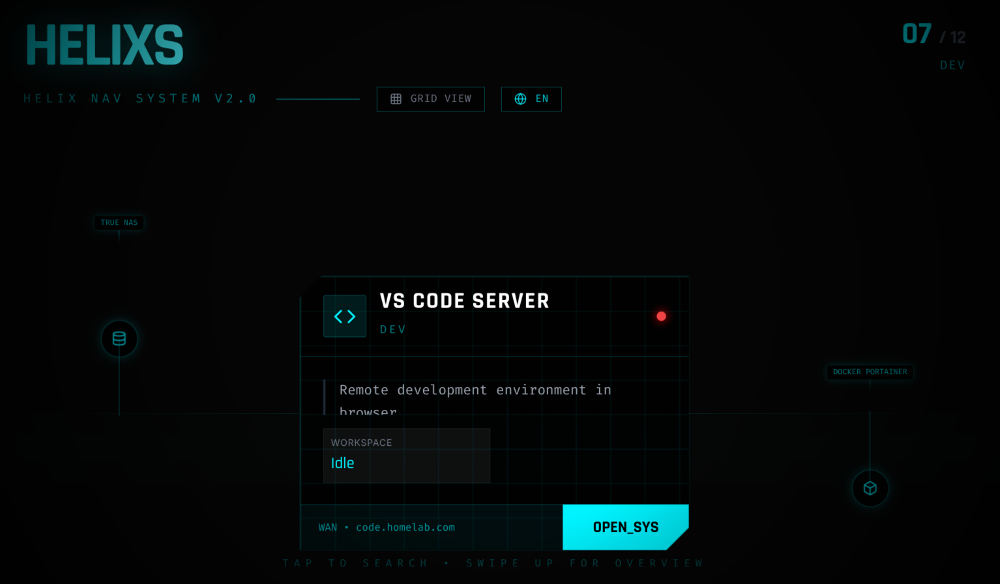

# Helixs

A futuristic, wireframe-style navigation interface for homelab services, featuring a DNA-helix interaction model and dynamic LAN/WAN routing.

Check out the [Demo](https://helixs-preview.vercel.app/)

https://github.com/user-attachments/assets/ec7fd49e-2259-4f50-9bcd-8776789c390e

## How to use

1. Visit the deployed address to view the navigation panel.
2. Scroll using mouse or touchpad to browse all service nodes; click to jump to the corresponding LAN/WAN address.
3. Typing on the keyboard will automatically trigger search to filter service names quickly.
4. When in GENOME VIEW, click the "GENOME VIEW" button to display all services in a text matrix.

## Deployment Methods

### One-click Vercel Deployment
Click the button below and select your repository. After the first deployment, configure environment variables such as `lang` (optional) in the Vercel dashboard.
[](https://vercel.com/new/clone?repository-url=https%3A%2F%2Fgithub.com%2Fchthollyphile%2Fhelixs)

### Docker Compose Deployment
Use the provided `docker-compose.yml` template, adjust values as needed, and then run `docker compose up -d`.

```yaml
services:
  helixs:
    image: papersman/helixs:latest
    restart: unless-stopped
    ports:
      - "3234:3234"
    environment:
      - lang=en
    volumes:
      - ./public/config.json:/app/public/config.json:ro
```

### Local/Server Node Deployment
1. Clone the repository and enter the directory:

   ```bash
   git clone <your-repo> helixs && cd helixs
   ```
2. Install dependencies: `npm install`
3. Development mode: `npm run dev` (defaults to [http://localhost:5173](http://localhost:5173))
4. Production build: `npm run build`
5. Start the server-side rendering entry: `npm start` (listens on port 3234 by default; override with the `PORT` environment variable)

### Docker Deployment
```bash
docker build -t helixs:latest .
docker run -d --name helixs \
  -e PORT=3234 \
  -e lang=en \
  -p 3234:3234 \
  -v $(pwd)/public/config.json:/app/public/config.json:ro \
  helixs:latest
```

You can use `scripts/push_docker.sh` to push the image to your own registry—just remember to replace the image name in the script.

## Configuration

* All service items displayed are sourced from `public/config.json`.

  * `lanUrl` and `wanUrl` determine which address to redirect to when accessed via LAN or WAN.
  * The `status` and `stats` fields are used for status indicators on the panel.
  * No container restart is required after modification, as long as the file is still mounted read-only.

* Environment Variables

  * `PORT`: The port the service listens on (default 3234).
  * `lang`: Default language; `en` by default. If a custom i18n configuration is mounted, you may set this to `zh` or others.

## FAQ

* **How do I sync configuration to a deployed instance?**

  * Local Node or Docker deployment: edit `public/config.json` directly and restart/hot-reload.
  * Vercel: store the configuration file in the repository and trigger a rebuild, or use external data sources such as Vercel KV/Edge Config.

* **How do I clean up or upgrade?**

  * Node deployment: `git pull && npm install && npm run build && npm start`.
  * Docker deployment: rebuild the image using `docker compose up -d --build` or run with `docker run --pull always`.

---
